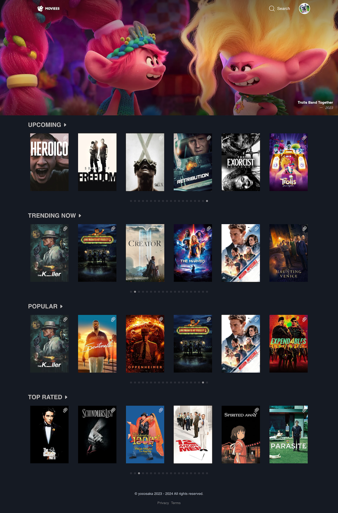

# 🎬 Moviees – For Curious Movie Lovers

A full-stack movie app designed for people who love to discover, collect, and share films — with clean UI, smooth UX, and clear structure.

---

## 🌟 About the Project

**Moviees** is a self-initiated movie library app built with **Next.js**, **TypeScript**, and **Supabase**.  
It allows users to:

- 🔍 **Search** and browse movies with responsive result filtering  
- 💬 **Review** films (privately or publicly)  
- ❤️ **Favorite & collect** titles into a personal list  
- 🔐 **Login with Google** to personalize your experience  
- 📣 **Share your public profile** with friends

### 🧠 UX Highlights
- Focused on **search experience** — responsive layout, minimal friction
- Designed with **result readability** and cognitive clarity in mind
- Structured the user flow to feel light and intuitive: search → action → feedback
- Integrated login with NextAuth for seamless personalization

This project blends frontend execution with UX thinking — from interaction flow to UI behavior — aiming to turn simple functionality into a pleasant, thoughtful user experience.

---

## 🚀 Tech Stack

- **Frontend**: Next.js / TypeScript / SCSS
- **Backend**: Supabase / Prisma
- **Auth**: NextAuth

<!-- ## Live App

[Live App Link](https://www.moviees.life/) -->

<!-- ## Getting Started

To get a local copy up and running follow these simple example steps.

1. On the project GitHub page, navigate to the main page of the repository.
2. Under the repository name, locate and click on a green button named `Code`.
3. Copy the project URL as displayed.
4. If you're running the Windows Operating System, open your command prompt. On Linux, Open your terminal.
5. Change the current working directory to the location where you want the cloned directory to be made. Leave as it is if the current location is where you want the project to be.
6. Type git clone, and then paste the URL you copied in Step 3.  
   e.g. $ git clone https://github.com/yourUsername/yourProjectName
7. Press Enter. Your local copy will be created.
8. Go to helpers/baseUrl.js and rewrite the baseUrl like `http://localhost:3001/` so you can run this project in your local environment
9. To run the server, run `npm start`
10. To run the tests, run `npm test` -->

## Author

👤 **Yoko Saka**
Frontend Developer & UX-Informed Thinker
- GitHub: [yoko-vicky](https://github.com/yoko-vicky)
- LinkedIn: [Yoko Saka](https://www.linkedin.com/in/yoko-vicky/)
- Portfolio: [View My Work](https://www.yokoworks.dev/)

## Contributing

Contributions, issues, and feature requests are welcome!
Feel free to check the [issues page](../../issues).

1. Fork the Project
2. Create your Feature Branch (`git checkout -b feature/AmazingFeature`)
3. Commit your Changes (`git commit -m 'Add some AmazingFeature'`)
4. Push to the Branch (`git push origin feature/AmazingFeature`)
5. Open a Pull Request

## Support

If you like this project, please consider giving it a star!

<!-- ## License

This project is [MIT](./LICENSE) licensed except for the design above -->

## Acknowledgements

- [Next auth](https://next-auth.js.org/)
- [Prisma](https://www.prisma.io/)
- [Supabase](https://supabase.com/)
